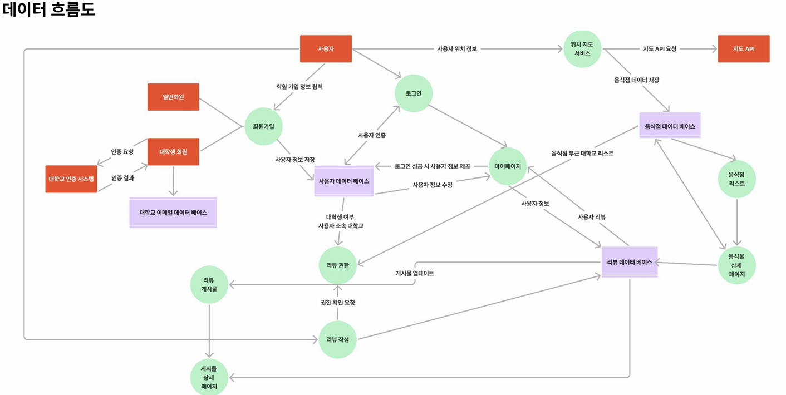
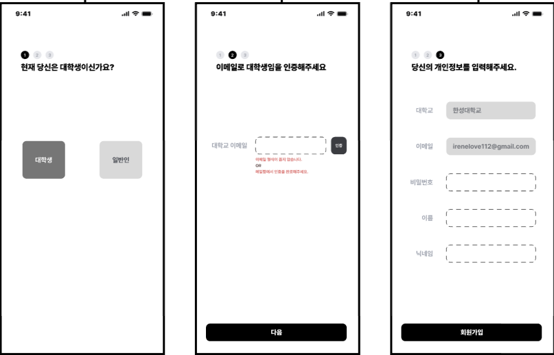
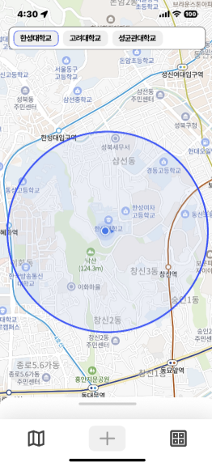
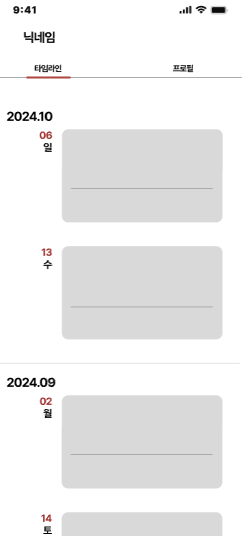

# 🍽️ 구르맛 (Gourmet)

> 대학생을 위한 로컬 맛집 추천 플랫폼

<br>

## 🎬 프로젝트 시연 영상

[](https://www.youtube.com/watch?v=uawsgHIxjP8)

> 📺 **클릭하여 전체 시연 영상 보기**

<br>

## 📖 프로젝트 개요

**구르맛(Gourmet)**은 대학생들이 쉽게 주변 맛집을 찾고 공유할 수 있는 위치 기반 맛집 추천 앱입니다.  
대학교를 중심으로 3km 반경 내 맛집 정보를 제공하며, Thread 스타일의 실시간 리뷰 피드를 통해 생생한 맛집 정보를 공유할 수 있습니다.

### 📅 개발 기간
**2024년 9월 2일 ~ 2024년 12월 20일** (15주)

### 👥 팀 구성 및 역할

| 이름 | 역할 |
|------|------|
| **최은서** (팀장) | Design & Frontend 개발 |
| **손주완** | Frontend,Backend 개발 |
| **전상우** | Frontend,Backend 개발 |
| **홍혜창** | Frontend,Backend 개발 |

<br>

## ✨ 주요 기능

### 🗺️ 1. 맛집 지도
- **위치 기반 서비스**: 대학교 중심 3km 반경 내 맛집 표시
- **대학교별 필터링**: 3개 주요 대학교 지원 (서울 소재)
- **실시간 위치 추적**: 사용자의 현재 위치 표시
- **지도 인터랙션**: 마커 클릭 시 음식점 간단 정보 표시

### 📝 2. 실시간 리뷰 게시물
- **Thread 스타일 피드**: SNS 형태의 직관적인 리뷰 피드
- **이미지 업로드**: 최대 5장의 음식 사진 업로드
- **별점 평가**: 1~5점 별점 시스템
- **좋아요/싫어요**: 리뷰에 대한 피드백 기능
- **리뷰 작성 제한**: 대학생 인증 완료 시에만 작성 가능

### 👤 3. 타임라인 & 마이페이지
- **리뷰 타임라인**: 내가 작성한 리뷰 시간순 정렬
- **프로필 관리**: 닉네임, 이메일, 소속 정보 표시
- **닉네임 수정**: 실시간 닉네임 변경 기능
- **리뷰 삭제**: 작성한 리뷰 관리

<br>

## 🎓 대학생 인증 시스템

### 인증 프로세스
1. **이메일 도메인 검증**: 학교 공식 이메일 주소 확인
2. **이메일 인증**: Firebase Authentication을 통한 이메일 인증 링크 발송
3. **60초 제한 시간**: 제한 시간 내 이메일 인증 완료 필요

### 권한 관리
- **대학생**: 리뷰 작성, 좋아요/싫어요, 음식점 조회
- **일반 회원**: 음식점 조회만 가능 (리뷰 작성 불가)

<br>

## 🛠️ 기술 스택

### Frontend
- 
- 

### Backend & Database
- 
  - **Firebase Authentication**: 이메일 기반 회원 인증
  - **Cloud Firestore**: NoSQL 실시간 데이터베이스
  - **Firebase Storage**: 이미지 파일 저장

### 주요 패키지

| 패키지 | 버전 | 용도 |
|--------|------|------|
| `google_maps_flutter` | ^2.5.0 | Google Maps 지도 표시 |
| `geolocator` | ^13.0.1 | GPS 위치 추적 |
| `cloud_firestore` | ^5.4.4 | Firestore 데이터베이스 연동 |
| `firebase_auth` | ^5.3.1 | Firebase 인증 |
| `firebase_storage` | ^12.3.4 | 이미지 업로드/다운로드 |
| `image_picker` | ^1.1.2 | 갤러리에서 이미지 선택 |
| `cached_network_image` | ^3.3.0 | 네트워크 이미지 캐싱 |
| `google_fonts` | ^6.2.1 | 커스텀 폰트 적용 |

<br>

## 🏗️ 시스템 설계

### 📊 데이터 흐름도


### 🗂️ 데이터베이스 구조

#### ERD (Entity Relationship Diagram)


#### 테이블 상세 정보


**주요 컬렉션 (Firestore)**
- `users`: 사용자 정보 (이메일, 닉네임, 대학교, 학생 여부)
- `Restaurant`: 음식점 정보 (이름, 위치, 카테고리, 영업시간, 메뉴)
- `Review`: 리뷰 정보 (별점, 내용, 이미지, 좋아요/싫어요 수)
- `Menu`: 메뉴 정보 (이름, 가격, 이미지)
- `University`: 대학교 정보 (이름, 이메일 도메인)

### 🧩 메뉴 구조도


<br>

## 📱 화면 구성

### 🔐 인증 화면

#### 스플래시 & 로그인
 

#### 회원가입 - 대학생


> **대학생 회원가입 절차**: 대학생/일반인 선택 → 학교 이메일 인증 → 개인정보 입력

#### 회원가입 - 일반 회원


> **일반 회원가입 절차**: 대학생/일반인 선택 → 직업 입력 → 개인정보 입력

<br>

### 🗺️ 맛집 지도

#### 지도 메인 화면
 

> **기능**: 대학교 선택 필터, 3km 반경 표시, 현재 위치 추적, 하단 음식점 리스트

#### 음식점 클릭


> **기능**: 지도 마커 클릭 시 음식점 간단 정보 (이름, 카테고리, 평점, 영업시간)

<br>

### 🍴 음식점 상세

#### 메뉴 탭 & 리뷰 탭
 

> **메뉴 탭**: 음식 사진, 메뉴명, 가격  
> **리뷰 탭**: 별점, 리뷰 내용, 사진, 작성일

<br>

### 📝 리뷰 작성 & 피드

#### 리뷰 작성 화면


> **기능**: 별점 선택, 리뷰 작성, 사진 추가 (최대 5장), 음식점 검색

#### 리뷰 피드


> **기능**: Thread 스타일 피드, 좋아요/싫어요, 실시간 업데이트

<br>

### 👤 마이페이지

#### 타임라인 & 프로필
 

> **타임라인**: 내가 작성한 리뷰 시간순 정렬, 리뷰 삭제  
> **프로필**: 이메일, 이름, 소속, 닉네임 수정

<br>

## 🚀 주요 구현 사항

### 1. 위치 기반 서비스
- `geolocator` 패키지를 활용한 실시간 GPS 추적
- Google Maps API를 통한 지도 표시
- 대학교 중심 좌표 기준 3km 반경 Circle 표시
- Firestore의 `Schools` 배열 필드를 활용한 음식점 필터링

### 2. Firebase 통합
- **Authentication**: 이메일 인증 기반 회원가입/로그인
- **Firestore**: 실시간 데이터 동기화 (`StreamBuilder` + `snapshots()`)
- **Storage**: 이미지 업로드 후 URL 저장

### 3. 실시간 업데이트
- Firestore의 `snapshots()` 메서드를 통한 실시간 데이터 스트림
- `FieldValue.increment()`를 활용한 좋아요/싫어요 카운터
- `arrayUnion`/`arrayRemove`를 통한 중복 방지

### 4. 이미지 처리
- `image_picker`로 갤러리에서 다중 이미지 선택
- Firebase Storage에 업로드 후 Firestore에 URL 저장
- `cached_network_image`로 이미지 로딩 최적화

<br>

## 🎯 프로젝트 목표 및 성과

### 목표
- ✅ 대학생 맞춤형 위치 기반 맛집 추천 시스템 구축
- ✅ 실시간 리뷰 공유를 통한 커뮤니티 활성화
- ✅ Firebase를 활용한 서버리스 백엔드 구현
- ✅ Flutter로 크로스 플랫폼 앱 개발

### 성과
- 3개 대학교 주변 맛집 데이터베이스 구축
- Thread 스타일의 직관적인 리뷰 피드 구현
- 대학생 인증 시스템을 통한 신뢰성 있는 리뷰 관리
- 실시간 데이터 동기화를 통한 사용자 경험 향상

<br>

## 📂 프로젝트 구조
```
gourmet_app/
├── lib/
│   ├── main.dart                           # 앱 진입점
│   ├── firebase_options.dart               # Firebase 설정
│   ├── screens/
│   │   ├── loginScreen.dart                # 로그인 화면
│   │   ├── signupScreen.dart               # 회원가입 화면
│   │   ├── mapScreen.dart                  # 지도 메인 화면
│   │   ├── restaurantDetailsScreen.dart    # 음식점 상세 화면
│   │   ├── uploadScreen.dart               # 리뷰 작성 화면
│   │   ├── threadScreen.dart               # 리뷰 피드 화면
│   │   └── myPageScreen.dart               # 마이페이지 화면
│   └── components/
│       └── restourantInfo.dart             # 음식점 정보 컴포넌트
├── docs/                                   # 문서 및 이미지
│   ├── data-flow-diagram.png
│   ├── database-erd.png
│   ├── database-table.png
│   ├── menu-structure.png
│   └── screen-*.png
├── images/                                 # 앱 내 리소스
│   └── loading.png
└── pubspec.yaml                            # 패키지 의존성 관리
```

<br>

## 🔧 개발 환경 설정

### 요구 사항
- Flutter SDK 3.24 이상
- Dart 3.5.3 이상
- Firebase 프로젝트 설정 (Authentication, Firestore, Storage 활성화)
- Google Maps API 키 발급


---

<div align="center">
  <strong>🍽️ 대학생을 위한 맛집 추천 플랫폼, 구르맛 🍽️</strong>
</div>
